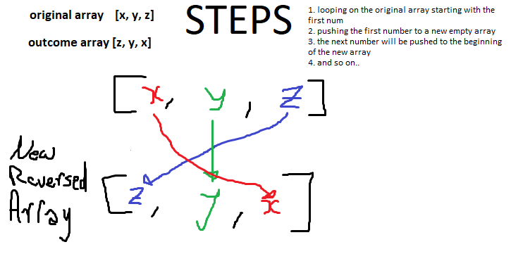

# Reverse an Array

reverseArray is a function that will perform a method to reverse an array and give back a new array reversed  

## Challenge

This challenge requires makig a function that takes in an array and reverses its elements producing a new reversed clone of the original array 

## Approach & Efficiency

I approached this challenge with looping on the original array then adding each number of it to a new empty array, adding the new number to the beginning of the array.

## Solution
