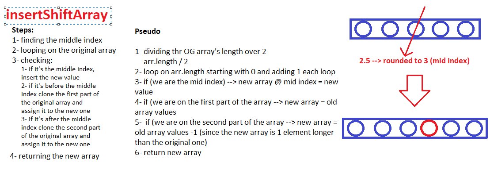

# Array Shift

insertShiftArray is a function that will perform a method to insert a value in the middle of the original array  

## Challenge

This challenge requires makig a function that takes in an array and inserts a value in between its original values

## Approach & Efficiency

I approached this challenge with looping on the original array then checking if its the first part of array and cloning it, if not, setting the new given value to the middle index of the new array and the second part of the old array attached to the new array

## Solution Whiteboarding
