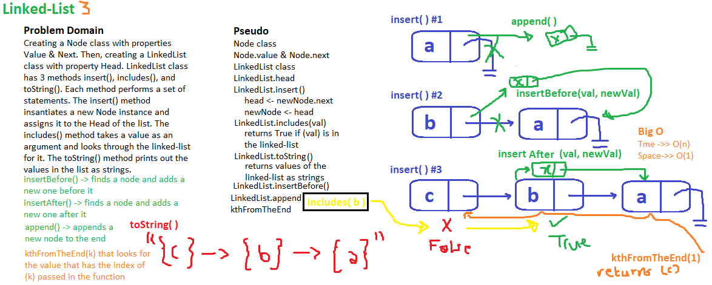
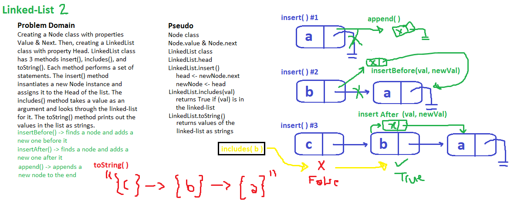
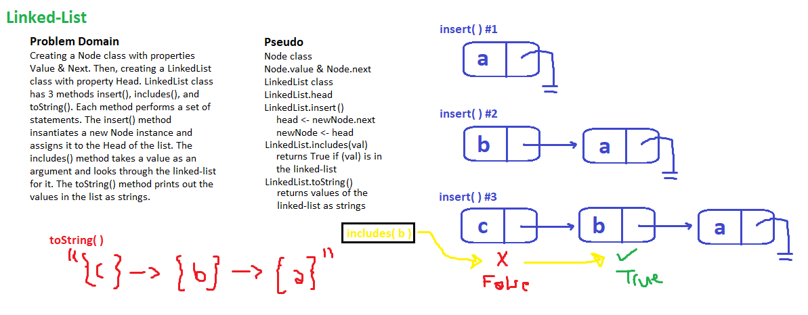

# Linked-List

LinkedList is a class that consists of a few methods which insert and look for a certain value in the linked list initiated with another class called Node

## Challenge

This challenge requires creating a class Node that has two properties (value, next) then creating another class LinkedList which will make a new instance of Node whenever its method (insert) is invoked, creating a linked list of nodes, then performing a bunch of methods on the list.

## Approach & Efficiency

I approached this challenge with creating a Node class with properties Value & Next. Then, creating a LinkedList class with property Head. LinkedList class has 6 methods insert(), insertBefore(), insertAfter(), append(), includes(), kthFromTheEnd(), and toString(). Each method performs a set of statements. The insert() method for example, insantiates a new Node instance and assigns it to the Head of the list. The includes() method takes a value as an argument and looks through the linked-list for it. The toString() method prints out the values in the list as strings.

## Solution Whiteboarding

