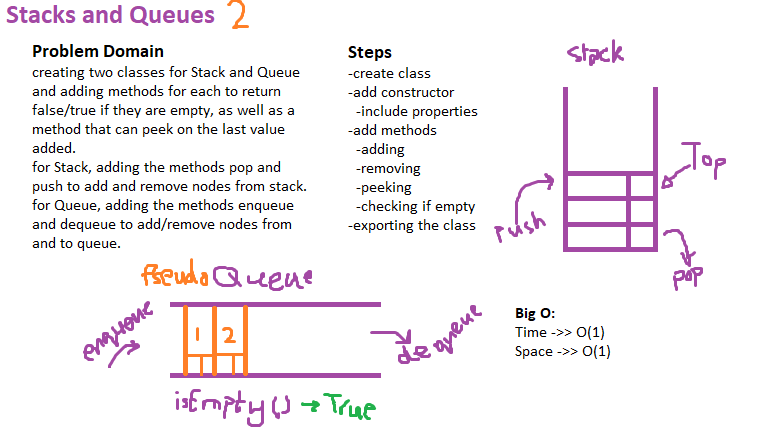

# Linked-List - CC11

## Challenge

To create a class PseudoQueue that performs methods on the Stack and Queue, like adding nodes to it, removing nodes from it.

## Approach & Efficiency

I approached this challenge by requiring the class Node created earlier to be able to add nodes. Requiring the class Stack to create a new emoty stack and perform methods on it. Creating a new class PseudoQueue that instantiates a new node and stack from the imported classes mentioned above, and performs methods on it.

## Solution Whiteboarding

