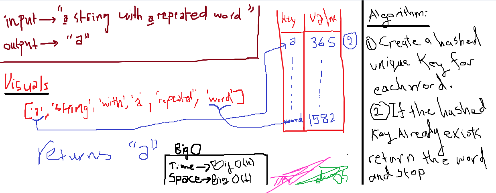

# RepeatedWord

A function that accepts a lengthy string parameter. Without utilizing any of the built-in library methods available to your language, return the first word to occur more than once in that provided string.

## Challenge

challenge requires creating a function that accepts a lengthy string parameter and return the first word to occur more than once in that provided string.

## Approach & Efficiency

Approached this challenge by creating a function that accepts a lengthy string parameter and return the first word to occur more than once in that provided string.

