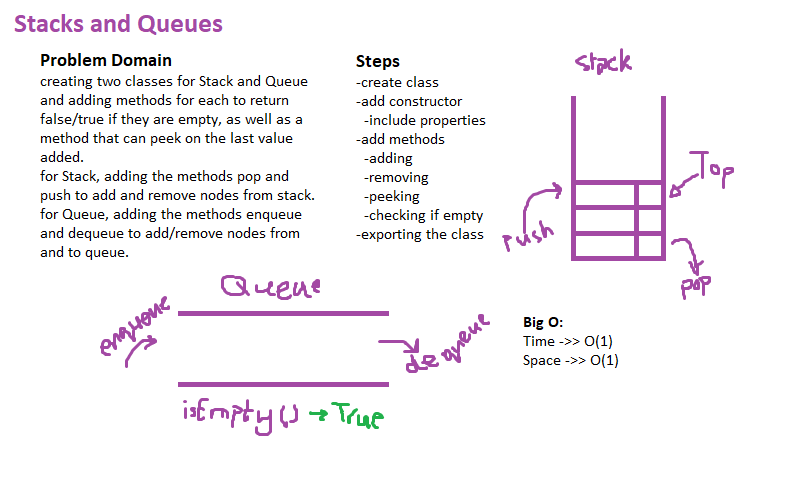

# Linked-List - CC8

## Challenge

To create classes Stack and Queue that perform methods on the Stack or Queue, like adding nodes to it, removing nodes from it or even checking if it is empty or not.

## Approach & Efficiency

I approached this challenge by creating a class Node to add nodes. A class Stack to create a new emoty stack and perform methods on it. A class Queue that instantiates a new Queue and performs methods on it.

## Solution Whiteboarding

