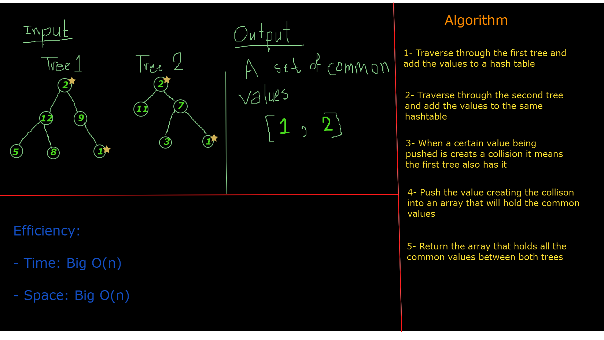

# Tree-Intersection
* A tree_intersection function that takes two binary tree parameters and returns a set of values found in both trees.

## Challenge
* Being able to allocate the common values between two trees

## Approach & Efficiency

* Time: Big O(n)

* Space: Big O(n)

## Solution
