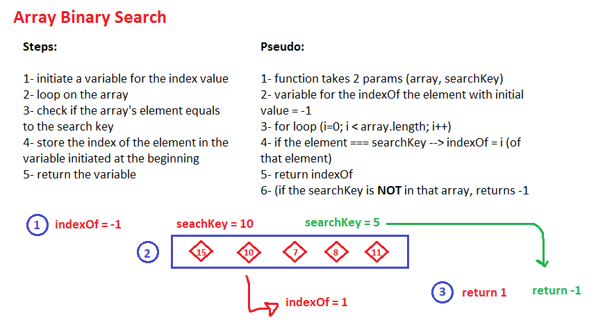

# Array Binary Search

binarySearch is a function that will perform a method to find the index of the search key provided in the array stored already, if it is not there, -1 will be returned   

## Challenge

This challenge requires making a function that takes in an array and a search key, looks for the search key in the array provided and returns the index of it if it is there, if not, it will return a -1 

## Approach & Efficiency

I approached this challenge with looping on the  array then checking if any of its elements is equal to the given search key and storing its index in a separate variable then returning that variable.  When the search key is not found, the function returns -1 

## Solution Whiteboarding
