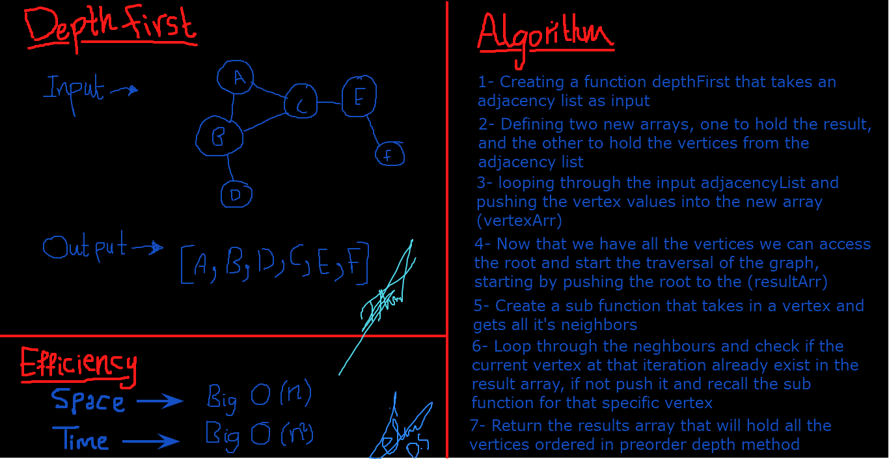

# Authors: Darah Shalabi & Muhammed Tommalieh

# Challenge Summary

A function which takes in an adjacency list as a graph, and conducts a depth first traversal. Then returns a collection of nodes in their pre-order depth-first traversal order.

## Challenge Description

Given an adjacency list as a graph, the function will conduct a depth first preorder traversal on it.

## Approach & Efficiency

Time ->> Big O(n^2)
Space ->> Big O(n)

## Solution
