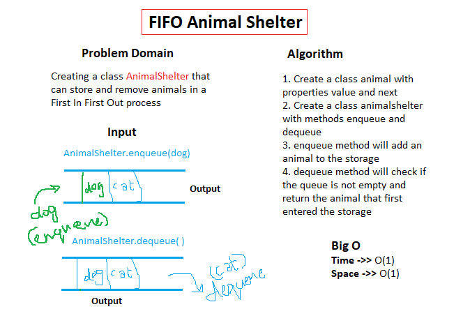

# Linked-List - CC11

## Challenge

Requires creating a class AnimalShelter that contains the animals in a shelter, we can add to the shelter, as well as retrieve the animals in there in a First In First Out manner.

## Approach & Efficiency

I approached this challenge by creating a class Animal that can create new animal instances with the properties: value and next. Then I created a class AnimalShelter that has two methods: enqueue and dequeue. The enqueue method can add to the beginning of the queue, and the dequeue method can pop from the end of the queue.

## Solution Whiteboarding

