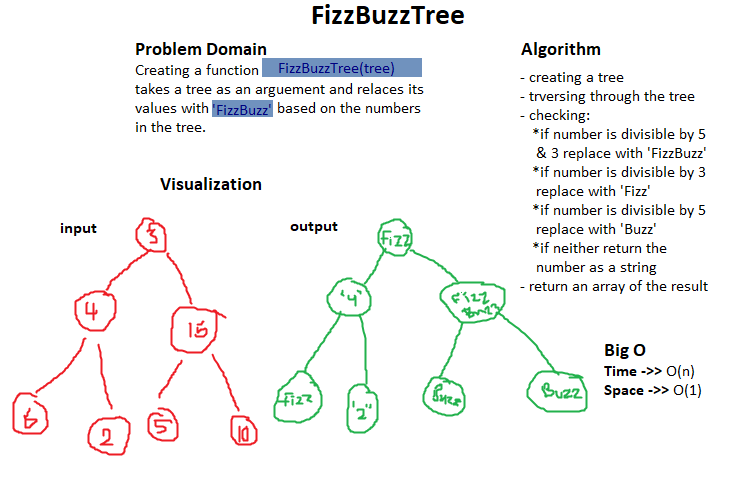

# Trees
A type of Data Structure that is implemented in differnet possible ways and can perform multiple methods

## Challenge
The challenge requires creating a functions called fizzBuzzTree that takes a tree as an argument and returns an array of the tree's values, where numbers divisible by 5 and 3 are replaced with 'FizzBuzz'. Numbers divisible by 5 replaced with 'Buzz', numbers divisible by 3 replaced with 'Fizz'. And finally the numbers that are not divisible by eaither will be stringified and returned.

## Approach & Efficiency
I approached this challenge by making up a tree and passing it to my fizz-buzz function as an argument, then traversing through the tree, pushing its values in a new array. Afterwards, I looped through the array checking if the values are divisible by 3 and 5, either of them, or neither. Then I replaced the values with their suitable word from 'FizzBuzz'.

## Whiteboarding
