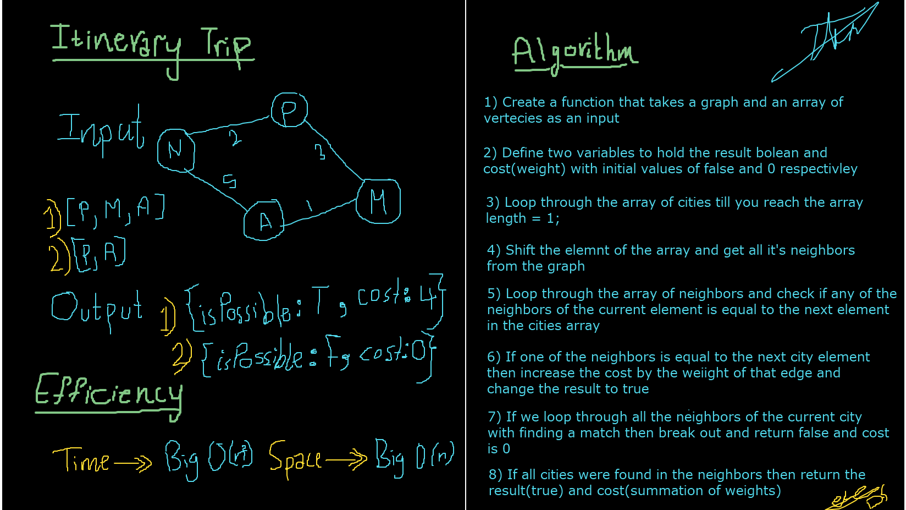

# Authors: Darah Shalabi & Muhammed Tommalieh

# Challenge Summary

A function which takes in a graph, and an array of city names. Then returns whether the full trip is possible with direct flights, and how much it would cost.

## Challenge Description

Given a business trip itinerary, and an Alaska Airlines route map, is the trip possible with direct flights? If so, how much will the total trip cost be?

## Approach & Efficiency

Time ->> Big O(n2)
Space ->> Big O(n)

## Solution
