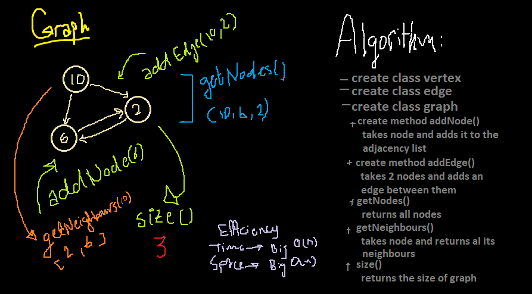

# Graphs

A graph is a collection of nodes with edges between them. If a node n1 is connected to another node n2 with an edge, we say n1 is adjacent to n2.

## Challenge

The challenge requires implementing a Graph. The graph represented as an adjacency list, and includes a few methods.

## Approach & Efficiency

Created a vertex class, edge class and a graph class with a few methods that can add, view and check the connections each vertex has in the graph.

## API

- addNode()
Takes in the value of the new node, adds that node to the graph, then returns the added node

- addEdge()
Takes in the two nodes to be connected by the edge and adds a new edge between two nodes in the graph

- getNodes()
Returns all of the nodes in the graph as a collection

- getNeighbors()
Takes in a given node, and returns a collection of edges connected to the given node with the weight of the connection included in the collection

- size()
Returns the total number of nodes in the graph

