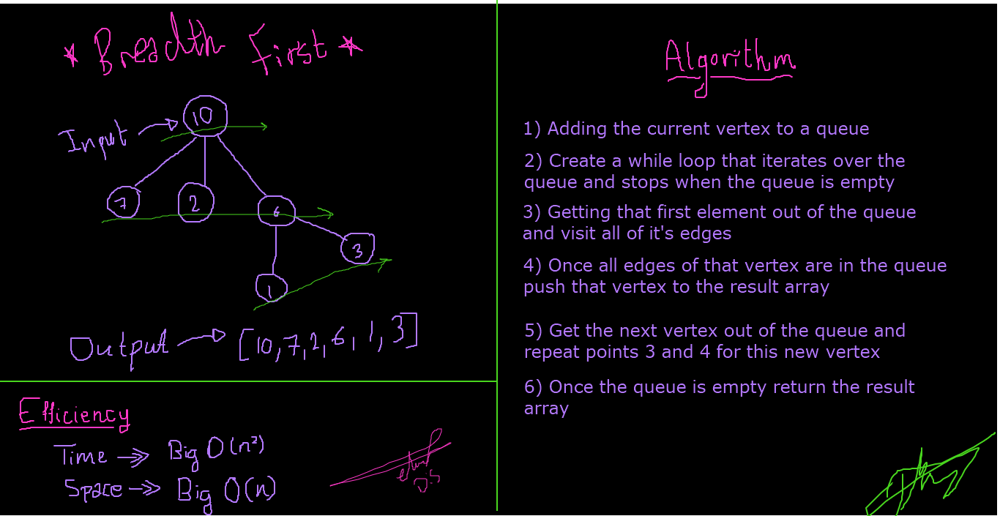

### Authors: Darah Shalabi & Muhammed Tommalieh

# Challenge Summary

Breadth First approach is a traversing algorithm where you should start traversing from a selected node and traverse the graph layerwise.

## Challenge Description

Creating a breadth-first traversal method that accepts a starting node and returns a collection of nodes in the order they were visited.

## Approach & Efficiency

Time ->> Big O(n2)
Space ->> Big O(n)

## Solution
