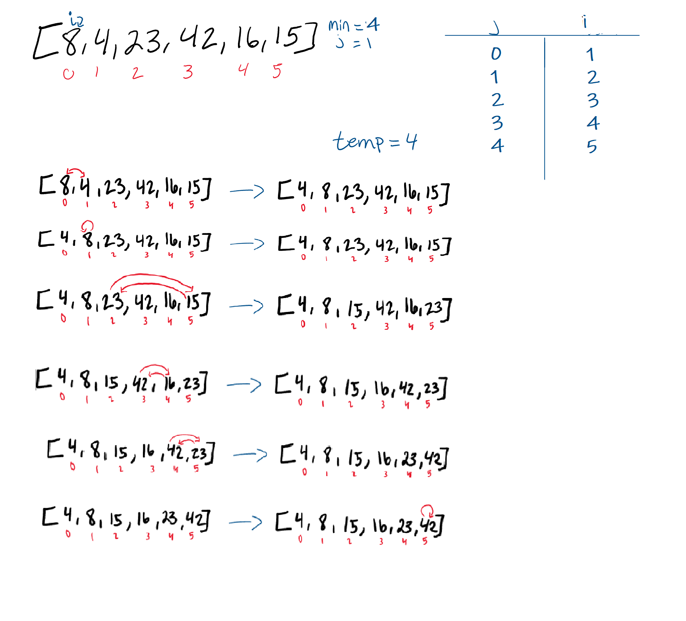

## Step 1
In the first pass through of the selection sort, We find this smaller number right away in index 1. The smaller number will be swapped with the current value in index i. This results in our smallest number of our array being placed first.

## Step 2
The second pass through the array, we check if there is a smaller value other than the current position of i. 8 is the 2nd smallest number in the array, so it “swaps” with itself.

## Step 3
The third pass through evaluates the remaining indices in the array, starting at position 2. Both position 4 and 5 are smaller than the value in position 2. In this case, 15 is the next smallest number. As a result, it will swap with position 2.

## Step 4
The 4th pass through on the array proves that 16 is the next smallest number in the array, and as a result, switches places with the 42.

## Step 5
The 5th pass through of the array only has one other index to evaluate. Since the last index value is larger than index 4, the two values will swap.

## Step 6
On its final iteratation through the array, it will swap places with itself as it evaluates the value against itself.

