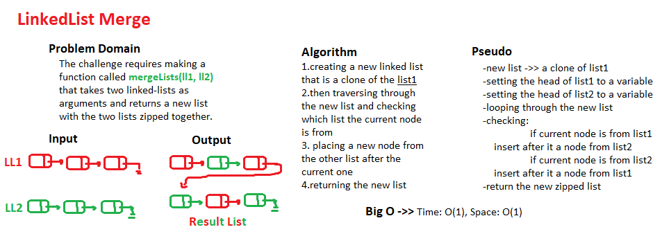

# Linked-List - CC8

## Challenge

Linked Lists Merging
This challenge requires merging two linked lists together alternating between one another, with an output of a zipped list that contains elements of both lists

## Approach & Efficiency

I approached this challenge by traversing through a copy of the first linked-list, then using the method insertAfter() to insert a new node after the already exists node after checking from which list the current node is.

## Solution Whiteboarding

