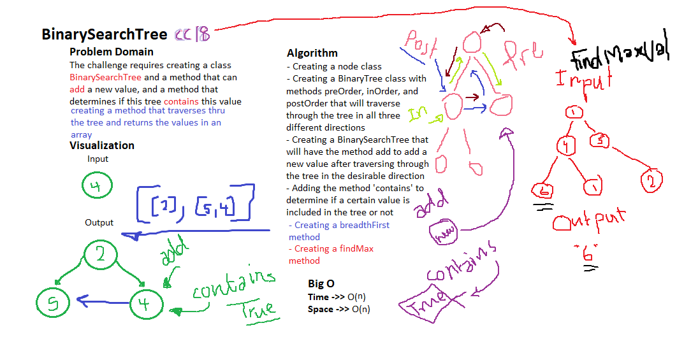

# Trees

A type of Data Structure that is implemented in differnet possible ways and can be traversed through in 3 directions

## Challenge

The challenge requires adding a method called findMaxValue that will accept a tree as its argument and loop through it to find and return the maximum value in the tree.

## Approach & Efficiency

I approached this challenge by creating a class BinaryTree then adding the method: findMaxValue that will walk through the tree creating an array of all the values, then loop on that array and return the highest of the values.

## Whiteboarding
