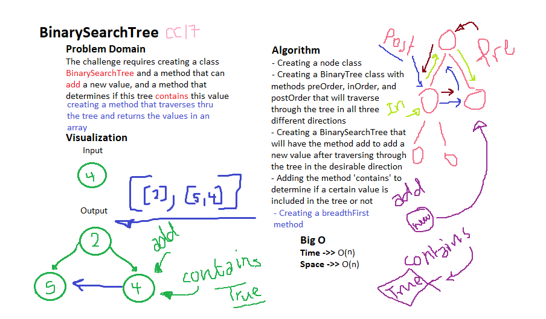

# Trees

A type of Data Structure that is implemented in differnet possible ways and can be traversed through in 3 directions

## Challenge

The challenge requires adding a method called breadthFirst that will accept a tree as its argument and loop through it line by line taking the values of the nodes in each line and storing it the array we are returning.

## Approach & Efficiency

I approached this challenge by creating a class BinaryTree then adding the method: breadthFirst which will help us walk through the tree in a line-by-line manner, and return an array of the values of each line of the tree.

## Whiteboarding
