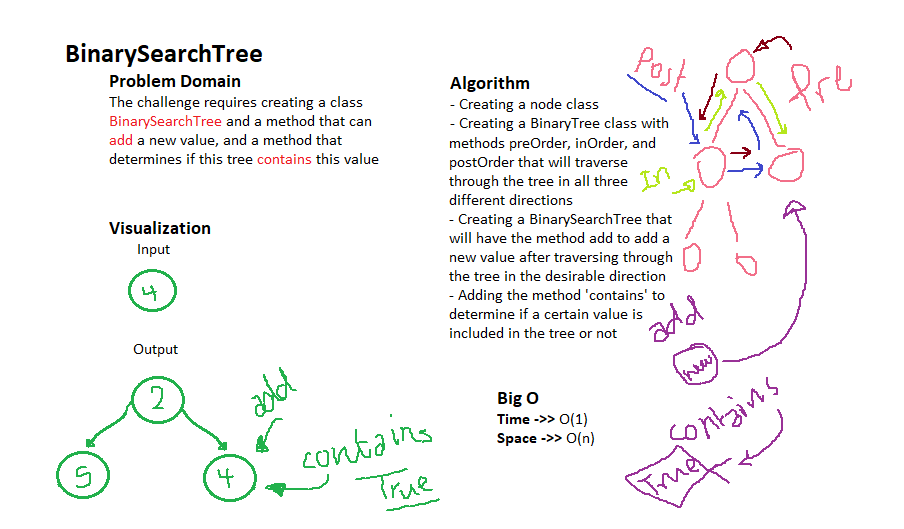

# Trees
A type of Data Structure that is implemented in differnet possible ways and can be traversed through in 3 directions

## Challenge
The challenge requires making 3 classes, class node, class binarytree, and class binarysearchtree. all together can take new values, traverse through the tree and add the values where they belong.

## Approach & Efficiency
I approached this challenge by creating a class BinaryTree that has the methods: preOrder, inOrder and postOrder which will help us choose the suitable direction to walk through the tree and find or add the value we want.

## Whiteboarding
